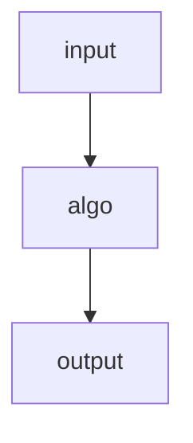

# Algorithm or effective procedure
An **algorithm** is a description of a sequence of finite and elementary steps which allows to reach some objectives. Elementary means something that is achievable "mechanically" (i.e. without intelligence).

We can think of an algorithm as a "black box" that transforms an input into an output, this transformation is performed by the sequence of elementary instructions specified by the algorithm.

The algorithm is **deterministic** if at any point in execution it is possible to determine the next step without ambiguity, this implies that each possible input will uniquely determine the corresponding output. Note that the procedure might not terminate so no output will be available.

This means that the algorithm determines a [[Definitions#^ff8ff7 | (partial) function]].

$$
f: input \rightarrow output
$$

We then say that the function $f$ is _computed_ by the algorithm and that $f$ is [[Definitions#^b2264c | computable]].
Notice that computability is defined on existence of the algorithm not on actually knowing what the algorithm is. 

There follows two functions to show examples about computability analysis.

### Example 1.1
Let
$$
g(n) = \begin{cases}
	1 & \text{There is a sequence of exactly } n \text{ 5 in } \pi\\
	0 & \text{otherwise}
\end{cases}
$$

A naive algorithm that we could try to use to compute this would be to:
1. Generate all the digits of $\pi$
2. If there is a sequence of $5$ long $n$ then return $1$
3. Otherwise return $0$

This is obviously not sound because the step 1 would require to generate an infinite sequence which is not possible on a computational machine.

Note that ***this doesn't mean that $g$ is not computable!***, we don't know if an actual algorithm exists to solve this problem in finite amount of steps, so we cannot conclude anything about the computability of $g$.

### Example 1.2
Let now be
$$
h(n) = \begin{cases}
	1 & \text{There is a sequence of \textit{at least} } n \text{ consecutive } 5 \text{ in } \pi \\
	0 & \text{otherwise}
\end{cases}
$$

The function is very similar to the $g$ of the [[#Example 1.2]] but we can make a very important observation which was not true before: if we find that for instance $h(3) = 1 \implies h(2) = 1 \text{ and } h(1) = 1$.

More precisely let $K = sup\{n \mid \pi \text{ contains } n \text{ consecutive digits } 5\}$, then either:
1. $K$ is finite, and thus: 
	$$ h(n) = \begin{cases}
		 1 & n \leq K\\
		 0 & \text{otherwise}
	\end{cases}
	$$
2.  $K$ is infinite, and thus  $$h(n) = 0 \quad \forall n \in \mathbb{N}$$

This implies that $h$ is actually computable because it is either a step function or a constant one and these are both evidently easy to compute with a simple program. We are not interested in the nature of $K$: we care about computability which means proving the existence of an algorithm for the computation, not on finding the actual solution.

# Algorithms and existence of non-computable functions
In the following section we will prove the existence of non-computable functions by algorithms.
### Mathematical notation
- _Natural numbers_: $\mathbb{N} = \{0, 1, 2, ...\}$
- Given the sets $A, B$ their _cartesian product_ is the set $A \times B = \{ (a, b) \mid a \in A, b \in B\}$, it follows that $A^n = A \times A \times ... \times A$ n times.
- A _relation_ $R$ is the subset of the cartesian product between sets: Given the sets $A, B, ..., N$ then the relation $R \subseteq A \times B \times ... \times N$
	- We can see a [[Definitions#^ff8ff7|(partial) function]] $f: A \rightarrow B$ as a special kind of relation where: $f \subset \{ (a, b) \mid a \in A, b \in B\}$ and for each pair of tuples if $(a, b_1), (a, b_2) \in f \implies b_1 = b_2$.
		- The domain of $f$ is $dom(f) = \{a \in A \mid \exists b \in B \text{ where } f(a) = b\}$
		- We indicate that the function $f$ is defined in $a$ with $f(a)\downarrow$, we indicate that it is undefined with $f(a)\uparrow$.
- Given a set $A$ we indicate its cardinality with $|A|$ (for finite sets it is the number of elements in the set).
- Given the sets $A, B$ we say that:
	- $|A| = |B|$ if there exist a bijective mapping between $A$ and $B$
	- $|A| \leq |B|$ if there exist an injective function between $A$ and $B$ (all the elements of $A$ are mapped into  _unique_ elements of $B$).
	![[injective-function-svg.svg]] Equivalently there exist a surjective function between $B$ and $A$ (all the elements in $A$ are part of the image). ![[surjective-function-svg.svg]]
	-  $A \subseteq B \implies |A| \leq |B|$
	- We say that a set $A$ is _countable_ or _denumerable_ if $|A| \leq |\mathbb{N}|$, so if there is a surjective function $f: \mathbb{N} \rightarrow A$, note that when this is the case we can _enumerate_ the elements of $A$, which correspond to the image of the function $f$.
	- When $A, B$ are countable then $A \times B$ is also countable.
		- _Proof_: we can place the elements of $A \times B$ in a matrix: $$ 
			A \times B = \begin{pmatrix} \cellcolor{yellow!30} (a_1, b_1) & (a_1, b_2) & \cellcolor{yellow!30} (a_1, b_3) & (a_1, b_4) & \cellcolor{yellow!30} (a_1, b_5) \\ (a_2, b_1) & \cellcolor{yellow!30} (a_2, b_2) & (a_2, b_3) & \cellcolor{yellow!30} (a_2, b_4) & (a_2, b_5) \\ \cellcolor{yellow!30} (a_3, b_1) & (a_3, b_2) & \cellcolor{yellow!30} (a_3, b_3) & (a_3, b_4) & \cellcolor{yellow!30} (a_3, b_5) \\ (a_4, b_1) & \cellcolor{yellow!30} (a_4, b_2) & (a_4, b_3) & \cellcolor{yellow!30} (a_4, b_4) & (a_4, b_5) \\ \cellcolor{yellow!30} (a_5, b_1) & (a_5, b_2) & \cellcolor{yellow!30} (a_5, b_3) & (a_5, b_4) & \cellcolor{yellow!30} (a_5, b_5) \end{pmatrix}$$