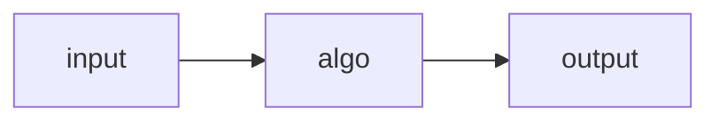

```toc
```
# Algorithm or effective procedure
An **algorithm** is a description of a sequence of finite and elementary steps which allows to reach some objectives. Elementary means something that is achievable "mechanically" (i.e. without intelligence).

We can think of an algorithm as a "black box" that transforms an input into an output, this transformation is performed by the sequence of elementary instructions specified by the algorithm.



The algorithm is **deterministic** if at any point in execution it is possible to determine the next step without ambiguity, this implies that each possible input will uniquely determine the corresponding output. Note that the procedure might not terminate so no output will be available.

This means that the algorithm determines a [[Definitions#^ff8ff7 | (partial) function]].

$$
f: input \rightarrow output
$$

We then say that the function $f$ is _computed_ by the algorithm and that $f$ is [[Definitions#^b2264c | computable]].
Notice that computability is defined on existence of the algorithm not on actually knowing what the algorithm is. 

There follows two functions to show examples about computability analysis.

### Example 1.1
Let
$$
g(n) = \begin{cases}
	1 & \text{There is a sequence of exactly } n \text{ 5 in } \pi\\
	0 & \text{otherwise}
\end{cases}
$$

A naive algorithm that we could try to use to compute this would be to:
1. Generate all the digits of $\pi$
2. If there is a sequence of $5$ long $n$ then return $1$
3. Otherwise return $0$

This is obviously not sound because the step 1 would require to generate an infinite sequence which is not possible on a computational machine.

Note that ***this doesn't mean that $g$ is not computable!***, we don't know if an actual algorithm exists to solve this problem in finite amount of steps, so we cannot conclude anything about the computability of $g$.

### Example 1.2
Let now be
$$
h(n) = \begin{cases}
	1 & \text{There is a sequence of \textit{at least} } n \text{ consecutive } 5 \text{ in } \pi \\
	0 & \text{otherwise}
\end{cases}
$$

The function is very similar to the $g$ of the [[#Example 1.2]] but we can make a very important observation which was not true before: if we find that for instance $h(3) = 1 \implies h(2) = 1 \text{ and } h(1) = 1$.

More precisely let $K = sup\{n \mid \pi \text{ contains } n \text{ consecutive digits } 5\}$, then either:
1. $K$ is finite, and thus: 
	$$ h(n) = \begin{cases}
		 1 & n \leq K\\
		 0 & \text{otherwise}
	\end{cases}
	$$
2.  $K$ is infinite, and thus  $$h(n) = 0 \quad \forall n \in \mathbb{N}$$

This implies that $h$ is actually computable because it is either a step function or a constant one and these are both evidently easy to compute with a simple program. We are not interested in the nature of $K$: we care about computability which means proving the existence of an algorithm for the computation, not on finding the actual solution.

# Algorithms and existence of non-computable functions
In the following section we will prove the existence of non-computable functions by algorithms.
### Mathematical notation
- _Natural numbers_: $\mathbb{N} = \{0, 1, 2, ...\}$
- Given the sets $A, B$ their _cartesian product_ is the set $A \times B = \{ (a, b) \mid a \in A, b \in B\}$, it follows that $A^n = A \times A \times ... \times A$ n times.
- A _relation_ $R$ is the subset of the cartesian product between sets: Given the sets $A, B, ..., N$ then the relation $R \subseteq A \times B \times ... \times N$
	- We can see a [[Definitions#^ff8ff7|(partial) function]] $f: A \rightarrow B$ as a special kind of relation where: $f \subset \{ (a, b) \mid a \in A, b \in B\}$ and for each pair of tuples if $(a, b_1), (a, b_2) \in f \implies b_1 = b_2$.
		- The domain of $f$ is $dom(f) = \{a \in A \mid \exists b \in B \text{ where } f(a) = b\}$
		- We indicate that the function $f$ is defined in $a$ with $f(a)\downarrow$, we indicate that it is undefined with $f(a)\uparrow$.
- Given a set $A$ we indicate its cardinality with $|A|$ (for finite sets it is the number of elements in the set).
- Given the sets $A, B$ we say that:
	- $|A| = |B|$ if there exist a bijective mapping between $A$ and $B$
	- $|A| \leq |B|$ if there exist an injective function between $A$ and $B$ (all the elements of $A$ are mapped into  _unique_ elements of $B$). <span style="display: block; margin:10px auto; width: 50%">![[injective-function-svg.svg]]</span> Equivalently there exist a surjective function between $B$ and $A$ (all the elements in $A$ are part of the image). <span style="display: block; width: 50%; margin: 10px auto">![[surjective-function-svg.svg]]</span>
	-  $A \subseteq B \implies |A| \leq |B|$
	- We say that a set $A$ is _countable_ or _denumerable_ if $|A| \leq |\mathbb{N}|$, so if there is a surjective function $f: \mathbb{N} \rightarrow A$, note that when this is the case we can _enumerate_ the elements of $A$, which correspond to the image of the function $f$.
	- When $A, B$ are countable then $A \times B$ is also countable.
		- _Proof_: we can place the elements of $A \times B$ in a matrix: $$ 
			A \times B = \begin{pmatrix}  (a_1, b_1) & (a_1, b_2) &  (a_1, b_3) & (a_1, b_4) &  (a_1, b_5) \\ (a_2, b_1) &  (a_2, b_2) & (a_2, b_3) &  (a_2, b_4) & (a_2, b_5) \\  (a_3, b_1) & (a_3, b_2) &  (a_3, b_3) & (a_3, b_4) &  (a_3, b_5) \\ (a_4, b_1) &  (a_4, b_2) & (a_4, b_3) &  (a_4, b_4) & (a_4, b_5) \\  (a_5, b_1) & (a_5, b_2) &  (a_5, b_3) & (a_5, b_4) &  (a_5, b_5) \end{pmatrix}$$
			They can be then enumerated along the diagonals as: $(a_1, b_1)$, $(a_1, b_2)$, $(a_2, b_1)$, $(a_1, b_3)$ and so on (_dove tail_ enumeration).
	- A countable union of countable sets is countable. ^b0965c

### Existence of non-computable functions

We now will show that, given an arbitrarily-fixed computational model following the constraints listed [[Definitions#^1acc78|here]], there are functions not computable in such a model.

Let $$\mathcal{F} = \{f \mid f: \mathbb{N} \rightarrow \mathbb{N}\}$$
be the set of all (partial) _unary functions_ over $\mathbb{N}$.

Then let $\mathcal{A}$ be the set of all the algorithms in our computational model. All algorithms $A \in \mathcal{A}$ computes a function $f_A: \mathbb{N} \rightarrow \mathbb{N}$. Recall that a function is said to be [[Definitions#^b2264c|computable]] in our model if there is an algorithm that computes it.

We can then define the set of computable unary functions as $$\mathcal{F}_\mathcal{A} = \{ f_A \in \mathcal{F} \mid A \in \mathcal{A}\}$$.
Obviously this implies that $\mathcal{F}_\mathcal{A} \subseteq \mathcal{F}$

Now, by the assumptions stated [[Definitions#^1acc78|here]], we can define an algorithm $A$ as a finite sequence of instructions and thus the set of all the algorithms is $$\mathcal{A} \subseteq \bigcup_{n \in \mathbb{N}} I^{n}$$

The set of all instructions is finite, thus countable. As stated [[#^b0965c|above]] a union of countable sets is countable which implies that $\mathcal{A}$ is countable: $|\mathcal{A}| \leq |\mathbb{N}|$.

Since the mapping 
$$\mathcal{A} \rightarrow \mathcal{F}_\mathcal{A}$$
$$A \mapsto f_{A}$$
is by definition _surjective_ this means that also $\mathcal{F}_\mathcal{A}$ is countable: $|\mathcal{F}_\mathcal{A}| \leq |\mathbb{N}|$.

The problem is that the set of all functions $\mathcal{F}$ is not countable.
To prove this let $\mathcal{T} \subset \mathcal{F}$ the set of all the _total_ functions ($\forall f \in \mathcal{T}, \ dom(f) = \mathbb{N}$).
Suppose that $\mathcal{T}$ is countable: this means we can enumerate all the functions in it as $f_1, f_2,...$ and write them systematically in a matrix:
$$
\begin{bmatrix}
f_0(0) & f_1(0) & f_2(0) & \dots \\
f_0(1) & f_1(1) & f_2(1) & \dots \\
f_0(2) & f_1(2) & f_2(2) & \dots \\
\vdots & \vdots & \vdots & \ddots \\
\end{bmatrix}
$$

Then we can define a function $d$ that operates on the diagonal of the matrix so that $d(n) = f_n(n) + 1$. This function is by definition total (defined on all naturals).

By definition $\forall n \in \mathbb{N} \ d \neq f_n$ but this is absurd since by hypothesis $\mathcal{T}$ contained all the total functions on $\mathbb{N}$ and we just crafted a new one.
Hence we have proved that the set of all total functions $\mathcal{T}$ is _not_ countable, thus:
$$
|\mathcal{F}_{A}| \leq |\mathbb{N}| \lt |\mathcal{T}| \lt |\mathcal{F}|
$$

This shows that **not all functions are computable**.

# URM Computability

## Introduction to Computational Models

There are various models of computation that have been proposed to formalize the notion of computability:

1. Turing machine (Turing, 1936)
2. λ-calculus (Church, 1930)
3. Partial recursive functions (Gödel-Kleene 1930)
4. Canonical deductive systems (Post, 1943)
5. Markov systems (Markov, 1951)
6. Unlimited Register Machine (URM) (Shepherdson - Sturgis, 1963)

Despite the variety, all these "sufficiently expressive" models define the same class of computable functions. This observation leads to the Church-Turing thesis.

### Church-Turing Thesis

> A function is computable by an effective procedure (i.e., in a finitary computational model, obeying the [[Definitions#^1acc78|conditions for an effective procedure]]) if and only if it is computable by a Turing machine.

**Note:** The Church-Turning thesis is not a formal theorem due to its reliance on the informal notion of an "effective procedure". It's supported by extensive evidence but cannot be formally proven.

## Unlimited Register Machine (URM)

We'll use the URM model to formalise the notion of computable functions. A URM consists of:

1. **Unbounded memory:** An infinite sequence of registers $(R_1, R_2, \ldots, R_n, \ldots)$, each storing a natural number. This might sound contradicting the fact that algorithm should use a _bounded_ amount of memory, but this is made so the machine will not limit the notion of computability no matter how big the necessary memory is. 
2. **Computing agent:** Capable of executing a URM program.
3. **URM program:** A finite sequence of instructions that can alter the machine's configuration.

### URM Instructions

1. **Zero:** $Z(n)$ - Sets the content of register $R_n$ to zero.
2. **Successor:** $S(n)$ - Increments the content of register $R_n$ by 1.
3. **Transfer:** $T(m,n)$ - Copies the content of register $R_m$ to $R_n$.
4. **Conditional Jump:** $J(m,n,t)$ - If the contents of $R_m$ and $R_n$ are equal, jump to instruction $t$; otherwise, continue to the next instruction.

Note the program will terminate when it encounters an empty instruction.

### URM Configuration and Execution

- **Configuration:** A sequence $(r_1, r_2, \ldots, r_n, \ldots) \in \mathbb{N}^\omega$ representing the contents of all registers.
- **State:** A pair $\langle c, t \rangle$ where $c$ is the configuration and $t$ is the program counter (index of the next instruction).

### URM Computation Notation

For a URM program $P$ and input $(a_1, a_2, a_3, \ldots) \in \mathbb{N}^\omega$:

- $P(a_1, a_2, \ldots) \downarrow$ : The computation halts.
- $P(a_1, a_2, \ldots) \uparrow$ : The computation diverges (never halts).
- $P(a_1, \ldots, a_k)$ : Shorthand for $P(a_1, \ldots, a_k, 0, \ldots, 0)$ when only finitely many inputs are non-zero.

## URM-Computable Functions

### Definition

A function $f: \mathbb{N}^k \to \mathbb{N}$ is URM-computable if there exists a URM program $P$ such that for all $(a_1, \ldots, a_k) \in \mathbb{N}^k$ and $a \in \mathbb{N}$:

$P(a_1, \ldots, a_k) \downarrow a$ if and only if $(a_1, \ldots, a_k) \in dom(f)$ and $f(a_1, \ldots, a_k) = a$.

The output is conventionally stored in register $R_1$.

### Classes of URM-Computable Functions

- $\mathcal{C}$: The class of all URM-computable functions
- $\mathcal{C}^{(k)}$: The class of k-ary URM-computable functions

This implies: 
$$
\mathcal{C} = \bigcup_{k\geq1} \mathcal{C}^{(k)}
$$

## Examples of URM-Computable Functions

**Addition**: $f(x,y) = x + y$

>_Idea_: Increment $R_1$ and $R_3$ until $R_2$ and $R_3$ contain the same value. This results in adding the content of $R_2$ to $R_1$.

Initial configuration: 
$$
\begin{array}{ | c | c | c |}
\hline
R_1 & R_2 & R_3 & \dots \\
\hline
x & y & 0 & \dots \\
\hline
\end{array}
$$

```
I₁: J(2,3,5)
I₂: S(1)
I₃: S(3)
I₄: J(1,1,1) // unconditional jump
```

**Predecessor**: $f(x) = x \dot{-} 1 = \begin{cases} 0 & \text{if } x = 0 \\ x - 1 & \text{if } x > 0 \end{cases}$

>_Idea_: If $x = 0$, it trivially terminates. If $x > 0$, it keeps a value $k-1$ in $R_2$ and $k$ in $R_3$, with $k > 1$ ascending until $R_3 = x$, at that point $R_2 = x - 1$.

Initial configuration: 
$$
\begin{array}{ | c | c | c |}
\hline
R_1 & R_2 & R_3 & \dots \\
\hline
x & 0 & 0 & \dots \\
\hline
\end{array}
$$

```
I₁: J(1,3,8)
I₂: S(3)
I₃: J(1,3,7)
I₄: S(2)
I₅: S(3)
I₆: J(1,1,3)
I₇: T(2,1)
```

**Half (for even numbers)**: $f(x) = \begin{cases} \frac{x}{2} & \text{if } x \text{ is even} \\ \uparrow & \text{otherwise} \end{cases}$

>_Idea_: Store an increasing even number in $R_2$ and store its half in $R_3$.
Initial configuration:

$$
\begin{array}{ | c | c | c |}
\hline
R_1 & R_2 & R_3 & \dots \\
\hline
x & 2k & k & \dots \\
\hline
\end{array}
$$

```
I₁: J(1,2,6)
I₂: S(2)
I₃: S(2)
I₄: S(3)
I₅: J(1,1,1)
I₆: T(3,1)
```

## Function Computed by a Program

For a program $P$ with $k$ parameters, there exists a unique function $f_P^{(k)}: \mathbb{N}^k \to \mathbb{N}$ defined as:

$f_P^{(k)}(a_1, \ldots, a_k) = \begin{cases} a & \text{if } P(a_1, \ldots, a_k) \downarrow a \\ \uparrow & \text{if } P(a_1, \ldots, a_k) \uparrow \end{cases}$

**Note:** The same function can be computed by different programs due to:
1. Addition of useless instructions
2. Different algorithms computing the same function

## Variations of URM and Their Computational Power

### Reduced URM ($URM^-$)

URM without transfer instructions.

**Theorem:** $\mathcal{C}^- = \mathcal{C}$

**Proof:** 
1. Obviously, $\mathcal{C}^- \subseteq \mathcal{C}$.
2. To prove $\mathcal{C} \subseteq \mathcal{C}^-$, we show that a transfer instruction $T(m,n)$ at step $t$ can be replaced with the following subroutine:

```
Z(n)
LOOP: J(m,n,END)
S(n)
J(1,1,LOOP)
END:
```

Formally given $f \in \mathcal{C}$, $f: \mathbb{N}^{k} \rightarrow \mathbb{N}$ by definition there is a program $P$ that computes $f$ such that ${f_P}^{(k)} = f$. We will show that we can transform it in a program $P^{'} \in URM^{-}$ such that ${f_{P^{'}}}^{(k)} = {f_{P}}^{(k)}$.
We proceed by induction on the number $h$ of transfer instructions in $P$. Note that we assume a _well formed_ program that halts at the last instruction plus one.

- Base case ($h=0$): Trivial, $P = P'$ since $P$ is already a $URM^-$ program.
- Inductive step ($h \to h+1$): Replace one transfer instruction with the subroutine above. The resulting program $P^{''}$ has $h$ transfer instructions. By the inductive hypothesis, there exists a $URM^-$ program $P'$ such that $f_P^{(k)} = f_{P^{''}}^{(k)} = f_{P'}^{(k)}$.

### URM with Swap Instructions (URM_S)

Replace transfer with swap instruction $T_S(m,n)$ that exchanges contents of registers $m$ and $n$.

**Theorem:** $\mathcal{C}_S = \mathcal{C}$

**Proof:** 
1. $\mathcal{C} \subseteq \mathcal{C}_S$: We know $\mathcal{C} \subseteq \mathcal{C}^-$ from the previous proof, and $\mathcal{C}^- \subseteq \mathcal{C}_S$, so $\mathcal{C} \subseteq \mathcal{C}_S$.
2. $\mathcal{C}_S \subseteq \mathcal{C}$: The swap instruction $T_S(m,n)$ can be encoded in URM as:

```
T(n,i)
T(m,n)
T(i,m)
```

where $i$ is a "new" register not used by the program.

We prove by induction on the number of swap instructions $h$ that any URM_S program can be transformed into an equivalent URM program.

### URM without Jump Instructions ($URM^{=}$)

**Theorem:** $\mathcal{C}^{=} \subset \mathcal{C}$

**Proof:** 
1. Clearly, $\mathcal{C}^{=} \subseteq \mathcal{C}$.
2. The inclusion is strict because $f: \mathbb{N} \to \mathbb{N}$ with $f(x) \uparrow \forall x$ is computable in URM but not in $URM^{=}$. All functions in $\mathcal{C}^{=}$ are total since programs without jump instructions always terminate.

**Characterization of unary functions in $\mathcal{C}_{nj}$:**
- $f(x) = c$
- $f(x) = x + c$

where $c$ is a constant in $\mathbb{N}$.

**Proof of characterization:**
Let $r_1(h,x)$ be the content of register $R_1$ after $h$ steps, starting from an initial configuration where $R_1$ contains $x$ and other registers contain 0.

We prove by induction on $h$ that after $h$ execution steps, $r_1(h,x)$ is equal to $x+c$ or $c$ for some suitable constant $c \in \mathbb{N}$.

- Base case ($h=0$): $r_1(0,x) = x$, which satisfies the claim with $c=0$.
- Inductive step ($h \to h+1$): By the inductive hypothesis, $r_1(h,x) = x+c$ or $r_1(h,x) = c$. The next instruction can be:
  - $Z(n)$: If $n=1$, $r_1(h+1,x) = 0$; otherwise, $r_1(h+1,x) = r_1(h,x)$.
  - $S(n)$: If $n=1$, $r_1(h+1,x) = r_1(h,x) + 1$; otherwise, $r_1(h+1,x) = r_1(h,x)$.
  - $T(m,n)$: If $n>1$ or $n=m=1$, then $r_1(h+1,x) = r_1(h,x)$. If $n=1, m>1$, we don't know the content of $r_1(h+1,x)$.

To resolve this issue, we can extend the proof to all the registers $r_j$ simultaneously, showing that $\forall j \in \mathbb{N} \ r_j(h,x)$ contains either $c$ or $x+c$ for a suitable constant $c$. This solves the problem and makes the last step working because now we do know the content of any register $r_j$.

# Decidable Predicates

A _k-ary predicate_ on $\mathbb{N}$ denoted as $Q(x_1, \dots , x_n)$ is a property that can be true or false, formally it can be seen as a:
- function: $Q: (x_1, \dots , x_n) \rightarrow \{true, false\}$
- set: $Q = \{ (x_1, \dots , x_n) \mid \text{the property is true for } (x_1, \dots , x_n)\}$
We will write $Q: (x_1, \dots , x_n)$ to denote $(x_1, \dots, x_n) \in Q$ or $Q(x_1, \dots, x_n) = true$.

$Q$ is (URM) computable if there exists a program $P$ that computes a function ${f_P}^{(k)}$ that returns $true$ in case $Q(x_1, \dots, x_n)$ and $false$ otherwise. The $true$ and $false$ values will be represented as 1 and 0 respectively.

## Decidable Predicate (Definition)

A predicate $Q \in \mathbb{N}^{k}$  is said to be _decidable_ if its _characteristic function_
$$
\mathcal{X}_Q(x_1, \dots, x_n) = \begin{cases}
1 & \text{if } Q(x_1, \dots, x_n) \\
0 & \text{otherwise}
\end{cases}
$$
is $URM$-computable.

**Note**: Any characteristic function is _total_, so for any possible $\mathcal{X}_Q(x_1, \dots, x_n)$, $dom(\mathcal{X}_Q) = \mathbb{N}^k$.

# Computability on Other Domains

The URM model we have defined is limited to operate on natural numbers, this means our notions about computability are also limited.

We can extend our concepts by applying an _effective encoding_ to the domain we are interested in, in this way we can map from the "foreign" domain to the natural numbers and, once we operated on the _encoded_ function we can map back to the original.

There are two main constraint for this operation:
1. The domain $D$ must be countable since this guarantees the existence of a bijective mapping $\alpha: D \rightarrow \mathbb{N}$. Bijective is necessary for $\alpha$ to be invertible: $\alpha ^ {-1} (\alpha (x)) = x$.
2. The encoding must be _effective_. We do not have a formal definition of "effectiveness".

## Function Computable on Generic Domain (Definition)

A function $f: D \rightarrow D$ is computable if $f^* = \alpha \circ f \circ \alpha^{-1}$ is $URM$-computable.

$$
\begin{equation*} \begin{array}{ccc}
D & \xrightarrow{f} &  D \\
\Big\downarrow{\scriptstyle\alpha} & & \Big\uparrow{\scriptstyle\alpha^{-1}} \\
\mathbb{N} & \xrightarrow{f^*} & \mathbb{N} \end{array} \end{equation*}
$$

### Example: Computability on Integers

To define computability for functions over $\mathbb{Z}$ we need an effective encoding $\alpha$.

One possible solution is the following:
$$
\alpha(z) = \begin{cases}
2z & \text{if } z \geq 0 \\
-2z - 1 & \text{otherwise}
\end{cases}
$$

Then it follows the inverse mapping is:
$$
\alpha^{-1}(n) = \begin{cases}
\frac{n}{2} & \text{if } n \text{ is even} \\
-\frac{n + 1}{2} & \text{if } n \text{ is odd}
\end{cases}
$$

Consider the function $f: \mathbb{Z} \rightarrow \mathbb{Z}$, $f(z) = |z|$. It is computable if $f^* = \alpha \circ f \circ \alpha^{-1}$ is $URM$-computable.

$$
f^*(n) = \alpha \circ f \circ \alpha^{-1}(n) \\
$$
$$
= \begin{cases}
(\alpha \circ f)(\frac{n}{2}) & \text{if } n \text{ is even} \\
(\alpha \circ f)(-\frac{n + 1}{2}) & \text{if } n \text{ is odd}
\end{cases}
$$
$$
= \begin{cases}
\alpha(\frac{n}{2}) & \text{if } n \text{ is even} \\
\alpha(-\frac{n + 1}{2}) & \text{if } n \text{ is odd}
\end{cases}
$$
$$
= \begin{cases}
n & \text{if } n \text{ is even} \\
n + 1 & \text{if } n \text{ is odd}
\end{cases}
$$

which is $URM$-computable thus proving the computability of $f$.

# Generation of Computable Functions

The aim here is to provide a way of proving that certain functions are computable by arguing that they are combinations of simpler functions that are known to be computable.

This amounts to showing that there are operations $op$ that take functions $f_1$, $f_2$ and compose them producing $op(f_1, f_2)$ in a way that if $f_1, f_2 \in \mathcal{C}$ then $op(f_1, f_2)$ is still in $\mathcal{C}$ ($\mathcal{C}$ is _closed_ over $op$).

More precisely we will prove that the $\mathcal{C}$ class is closed with respect to the following operations:
- _(generalized) composition_
- _primitive recursion_
- _(unbounded) minimization_

After this, in order to prove that a function $f : \mathbb{N}^k \to \mathbb{N}$ is computable we have two techniques: write a URM program $P$ that computes $f$ (i.e., such that $f^{(k)}_P = f$), or use the closure theorems of $\mathcal{C}$.

Actually the three operations above are chosen carefully. The long term objective is to show that $\mathcal{C}$ coincides with the class of functions which can be obtained through composition, primitive recursion and minimization, starting from a restricted core of basic functions (partial recursive functions of Gödel-Kleene).

##  Basic computable functions

The following basic functions are URM-computable:

1. constant zero
   $z : \mathbb{N}^k \to \mathbb{N}$
   $(x_1, \ldots, x_k) \mapsto 0$

2. successor
   $s : \mathbb{N} \to \mathbb{N}$
   $x \mapsto x + 1$

3. projection
   $U^k_i : \mathbb{N}^k \to \mathbb{N}$
   $(x_1, \ldots, x_k) \mapsto x_i$

In fact, one immediately sees that these basic functions are computed by simple programs consisting of one arithmetic instruction:

1. $z$ computed by $Z(1)$;
2. $s$ computed by $S(1)$;
3. $U^k_i$ computed by $T(i, 1)$.

>**Remark**: The identity is just a special projection.

To prove the closure properties we will need to "combine" programs so we need some notation.

## General Notation

Given a URM program $P$
- $\rho(P)$ is the largest register index used in $P$
- $l(P)$ is the number of instructions in $P$;
- $P$ is in standard form if, for each $J(m, n, t)$ instruction, $t \leq l(P) + 1$ (if the program terminate it will do so at the instruction $l(P) + 1$).

Considering only programs in standard form is not restrictive, as stated by the following lemma:

>**Lemma** For each URM program $P$ there exists an equivalent program $P'$ in standard form, i.e. for all $k$, $f^{(k)}_P = f^{(k)}_{P'}$

*Proof.* It is enough to replace every instruction $J(m, n, t)$ in $P$ such that $t > l(P) + 1$ with $J(m, n, l(P) + 1)$ $\square$

Often we will have to concatenate programs. Given programs $P, Q$, their concatenation is obtained by considering $P$ followed by the instructions of $Q$. Only observe that jump instructions in $Q$ need to be updated (each instruction $J(m, n, t)$ in $Q$ is replaced with $J(m, n, t + l(P))$).

>**Remark**: If $P$ and $Q$ are in standard form then $PQ$ is in standard form; moreover $(PQ)R = P(QR)$. We will assume every program is in standard form and we will use concatenation freely.

It will be useful to consider programs which take the input and give the output in arbitrary registers.

Given a program $P$, we want a program $P[i_1, \ldots, i_k \to h]$ that takes input from $R_{i1}, \ldots, R_{ik}$, without assuming that the remaining the registers are set to 0, and gives back the output in $R_h$. This is easily obtainable with transfer and reset operations to move the contents of registers from $i_1, \ldots, i_k$ to $1, \ldots, k$ and the output from $h$ to $1$.

More precisely $P[i_1, \ldots, i_k \to h]$ is as follows:
$$
\begin{align}
& \texttt{T}(i_1, 1) \\
& \dots \\
& \texttt{T}(i_k, k) \\
& \texttt{Z}(k + 1) \\
& \dots \\
& \texttt{Z}(\rho(P)) \\
& P \\
& T(1, h)
\end{align}
$$

## Generalized composition

Given a function $f : \mathbb{N}^k \to \mathbb{N}$ and functions $g_1, \ldots, g_k : \mathbb{N}^n \to \mathbb{N}$ we define the composition $h : \mathbb{N}^n \to \mathbb{N}$ by

$$
h(\vec{x}) = \begin{cases}
f(g_1(\vec{x}), \ldots, g_k(\vec{x})) & \text{if } g_1(\vec{x}) \downarrow, \ldots, g_k(\vec{x}) \downarrow \text{ and } f(g_1(\vec{x}), \ldots, g_k(\vec{x})) \downarrow \\
\uparrow & \text{otherwise}
\end{cases}
$$

**Example**: Consider
$z(x) = 0 \quad \forall x \qquad ?(x) \uparrow \quad \forall x$
then
$z(?(x)) \uparrow \quad \forall x$

**Example**: Consider $?$ and $U^2_1$, then
$U^2_1(x_1, x_2) = x_1$ but $U^2_1(x_1, ?(x_2)) \uparrow$

>**Proposition**: $\mathcal{C}$ is closed under generalised composition

*Proof.*: Let

$f : \mathbb{N}^k \to \mathbb{N};\ g_1, \ldots, g_k : \mathbb{N}^n \to \mathbb{N}$
in $\mathcal{C}$, consider the composition
$h : \mathbb{N}^k \to \mathbb{N} \quad \vec{x} \mapsto f(g_1(\vec{x}), \ldots, g_k(\vec{x}))$

Since $f, g_1, \ldots, g_k \in \mathcal{C}$, we can take $F, G_1, \ldots, G_k$ programs in standard form for them.

Let us consider the largest register index possibly used by the involved programs i.e., $m = \max\{\rho(F), \rho(G_1), \ldots \rho(G_k), k, n\}$. Then the registers from $m + 1$ on can be used freely without the risk of interferences. We can then store the vector input $\vec{x}$ from $m + 1$ on and keep it for all the $G_i$. 
The idea is chaining sequentially the executions of $G_i$ and then executing $F$ on the results.

$$
\begin{array}{|c|c|c|c|c|c|c|}
\hline
1 \dots m & m + 1 & \dots & m + n & m + n + 1 & \dots & m + n + k \\
\hline
\dots & x_1 & \dots & x_n & g_1(\vec{x}) & \dots & g_k(\vec{x}) \\
\hline
\end{array}
$$

$$
\begin{align}
& T(1, m + 1) \\
& \dots \\
& T(n, m + n) \\
& G_1[m + 1, \dots, m + n \rightarrow m + n + 1] \\
& \dots \\
& G_k[m + 1, \dots, m + n \rightarrow m + n + k] \\
& F[m + n + 1, \dots, m + n + k \rightarrow 1] \\
\end{align}
$$

This allows us to conclude that $h \in \mathcal{C}$.

**Example**: If $f : \mathbb{N}^2 \to \mathbb{N}$ is computable, then the following are also computable
- $f_1(x, y) = f(y, x)$;
- $f_2(x) = f(x, x)$;
- $f_3(x, y, z) = f(x, y)$.

>**Remark**: On the basis of the results above we can use generalised composition when the $g_i$ are not functions of all the variables or are functions with repetitions.

>**Remark**: Function composition may "hide" several projections: we know that $f : \mathbb{N}^2 \to \mathbb{N}$ where $f(x_1, x_2) = x_1 + x_2$ is computable. Using this fact and the closure of $\mathcal{C}$ under generalise composition we can derive that $g : \mathbb{N}^3 \to \mathbb{N}$ where $g(x_1, x_2, x_3) = x_1 + x_2 + x_3$ is also computable. In fact $g(x_1, x_2, x_3) = f(f(x_1, x_2), x_3) = f(f(U^3_1(\vec{x}), U^3_2(\vec{x})), U^3_3(\vec{x}))$, that is computable.

### Example: Computable Functions under Composition
The following functions are computable
- **constant**: $m(\vec{x}) = m$
  $m(\vec{x}) = s(s(\ldots s(z(\vec{x}))))$, i.e., $s$ applied $m$ times;
- **addition**: $g(x_1, \ldots, x_k) = x_1 + \cdots + x_k$, as seen before;
- **product by a constant**: $f(x) = k \cdot x = g(x, \ldots, x)$, where $g$ is the function at the previous step;
- if $f(x, y)$ is computable, then also $f'(x) = f(x, m)$ is computable. In fact $f'(x) = f(x, m) = f(U^1_1(x), m(x))$, that is computable;
- if $f : \mathbb{N} \to \mathbb{N}$ is total computable, the predicate $Q(x, y) = "f(x) = y"$ is decidable.
  In fact, we know that
  $$X_{Eq}(x, y) = \begin{cases}
  1 & x = y \\
  0 & \text{otherwise}
  \end{cases}$$
  is computable.
  Therefore $X_Q(x, y) = X_{Eq}(f(x), y) = X_{Eq}(f(U^2_1(x, y)), U^2_2(x, y))$, and thus $X_Q$ is computable.

## 6.3. Primitive recursion

Recursion is a familiar concept; it allows to define a function specifying its values in terms of other values of the same function (and possibly using other functions already defined).

**Example 6.13 (Factorial).**
$$\begin{cases}
0! = 1 \\
(n + 1)! = n! \cdot (n + 1)
\end{cases}$$

**Example 6.14 (Fibonacci).**
$$\begin{cases}
f(0) = 1 \\
f(1) = 1 \\
f(n + 2) = f(n) + f(n + 1)
\end{cases}$$

There are many types of recursion, here we use a very "controlled" version of recursion.

**Definition 6.15 (Primitive recursion).** Given $f : \mathbb{N}^k \to \mathbb{N}$ and $g : \mathbb{N}^{k+2} \to \mathbb{N}$ functions, we define $h : \mathbb{N}^{k+1} \to \mathbb{N}$ by primitive recursion as follows
$$\begin{cases}
h(\vec{x}, 0) = f(\vec{x}) \\
h(\vec{x}, y + 1) = g(\vec{x}, y, h(\vec{x}, y))
\end{cases}$$

**Remark 6.16.** The function $h$ is defined in an equational manner, with $h$ that appears on both sides: it is an implicit definition and it is not obvious that such $h$ exists or that it is unique, but actually it does exist and it is unique. However, a general theory that supports this observation is not trivial.

The argument proceeds as follows
1. let $\mathbb{N}^n \to \mathbb{N}$ the set of functions on natural numbers with $n$ arguments
2. we define an operator
   $$T : (\mathbb{N}^{k+1} \to \mathbb{N}) \to (\mathbb{N}^{k+1} \to \mathbb{N})$$
   $$T(h)(\vec{x}, 0) = f(\vec{x})$$
   $$T(h)(\vec{x}, y + 1) = g(\vec{x}, y, h(\vec{x}, y))$$
3. the desired function is a fixed points of $T$, i.e. $h$ such that $T(h) = h$;
4. the existence of the fixed point follows from these properties
   - $\mathbb{N}^{k+1} \to \mathbb{N}$ is a CPO;
   - $T$ is continuous;
   - continuous functions over a CPO have a least fixed point.
5. uniqueness can be proved inductively, showing that if $h, h'$ are fixed points then $h = h'$.

**Example 6.17.** Consider the sum function $h(x, y) = x + y$. It can be defined by primitive recursion as
$$\begin{cases}
h(x, 0) = x = f(x) \\
h(x, y + 1) = h(x, y) + 1 = g(h(x, y))
\end{cases}$$
where $f$ is the identity and $g$ is the successor. Both are computable, so the sum is computable by primitive recursion.

**Proposition 6.18.** Functions obtained from total functions by
1. generalized composition
2. primitive recursion
are total.

*Proof.*
1. obvious by definition;
2. Let $f : \mathbb{N}^k \to \mathbb{N}$, $g : \mathbb{N}^{k+2} \to \mathbb{N}$ be total functions and define $h$ by primitive recursion.
   It can be proved by induction on $y$ that
   $\forall \vec{x} \in \mathbb{N}^k \quad (\vec{x}, y) \in dom(h)$
   - $(y = 0)$: for all $\vec{x} \in \mathbb{N}^k$, $h(\vec{x}, 0) = f(\vec{x}) \downarrow$;
   - $(y \to y+1)$: for all $\vec{x} \in \mathbb{N}^k$, $h(\vec{x}, y+1) = g(\vec{x}, y, h(\vec{x}, y)) \downarrow$ by inductive hypothesis.
$\square$

**Example 6.19.** We observe that some functions can be defined by primitive recursion:

- sum $x + y$
  $$\begin{cases}
  x + 0 = x \\
  x + (y + 1) = (x + y) + 1
  \end{cases}$$
  $$\begin{cases}
  h(x, 0) = x \\
  h(x, y + 1) = h(x, y) + 1
  \end{cases}$$
  $f(x) = x$
  $g(x,